# Arclet

Arclet is a testnet-first conversational wallet that turns a user's instruction into an immutable, reviewable trading mandate. A deterministic policy engine evaluates approved Graph evidence before a restricted Circle Agent Wallet adapter may submit a bounded swap on Arc.

> Current status: the offline financial core, fail-closed adapters, setup UI, database schema, worker lease primitives, and tests are implemented. Both candidate markets remain disabled because no authenticated Graph/Circle/Privy live flow has been run in this repository. No live transaction is claimed.



## Safety and custody

The Privy personal wallet and Circle trading wallet are different wallets. The personal wallet is user-controlled. Funds transferred to the dedicated Circle wallet are under Arclet's application-operated authority. A signed mandate is application authorization, not an onchain spending-control contract. Mainnet and trading are disabled by default.

## Prerequisites

- Bun 1.3.0
- Docker with Compose
- Provider credentials listed in `.env.example`
- A human-completed Circle Agent Wallet login and terms/OTP flow in a protected home directory

## Local setup

```sh
bun install --frozen-lockfile
cp .env.example .env
docker compose up -d db
bun run db:migrate
bun run doctor
bun run dev
```

The first dependency resolution created the committed `bun.lock`; subsequent installs use `--frozen-lockfile`. Missing credentials produce a setup state and failed readiness, never mock success.

## Verification

```sh
bun run lint
bun run typecheck
bun run test
bun run test:integration
bun run test:e2e
bun run build
bun run doctor
bun run probe:arc
bun run probe:graph
bun run probe:circle
bun run check:readiness
```

`probe:*` commands are non-mutating. `probe:graph` and `probe:circle` report BLOCKED without credentials/session state. `verify:live` is opt-in, testnet-only, and currently remains blocked until provider schemas and human authorization are recorded. It is never run in CI.

## Architecture

- `packages/domain`: strict strategy, approval, execution-state, canonical JSON, and exact money contracts.
- `packages/policy`: pure ordered fail-closed evaluation.
- `packages/graph`: allowlisted Graph client, schema validation, token orientation, and provenance.
- `packages/circle`: absolute-path, `shell: false` process boundary and fixed command arguments.
- `packages/chain`: Arc client, token metadata, and independent ERC-20 receipt verification.
- `packages/db`: PostgreSQL/Drizzle durable facts and uniqueness constraints.
- `apps/worker`: leased job polling and per-wallet advisory lock boundary. External submissions remain gated.
- `apps/web`: the one-screen newspaper-style wallet desk, setup/archive routes, and authenticated fail-closed API surfaces. The desk reviews and signs bounded proposals through Privy only after the selected market is verified, prepares explicit funding and fixed-destination withdrawal signatures, and renders its decision tape, trade ledger, archive, and USDC line from tenant-scoped persisted facts only.

## Current limitations

No market is enabled, no wallet is assigned, and no transaction evidence exists. The desk's chart intentionally remains empty until coherent wallet snapshots exist; it is a persisted ERC-20 USDC balance view, not profit or a valuation. The Graph deployment/pool, Circle CLI response schema and wallet inventory, Privy Arc transaction path, cirBTC decimals, and mainnet capabilities require real probes and human review. See `docs/BLOCKERS.md`, `docs/STATUS.md`, and `docs/TEST_REPORT.md`.

## Submission materials

Architecture, sponsor requirements, demo script, presentation outline, evidence manifest, AI-use disclosure, human-review log, and mainnet runbook live under `docs/`. The team must add genuine live evidence and a human-narrated video before making a qualifying claim.
